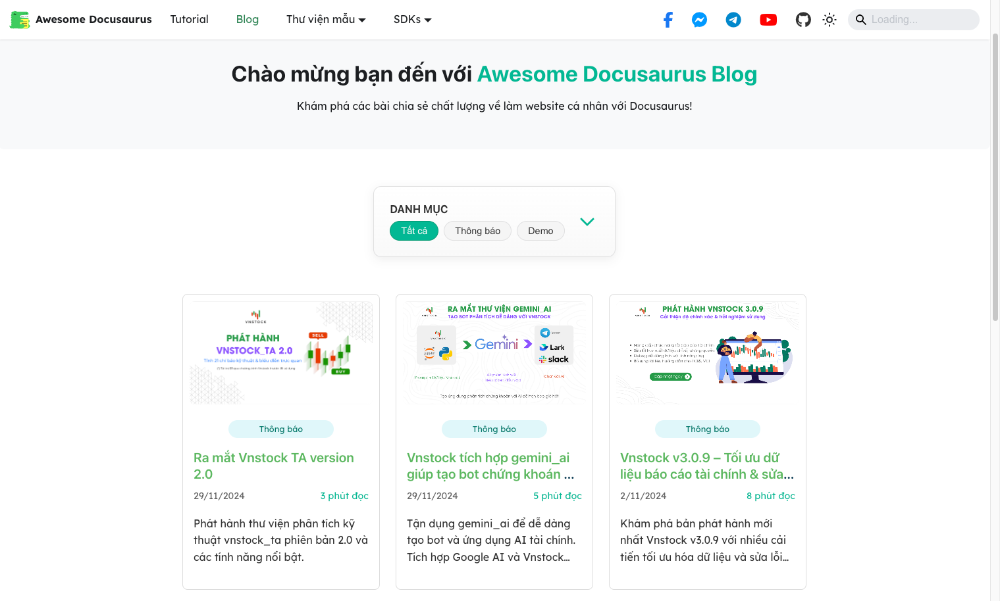
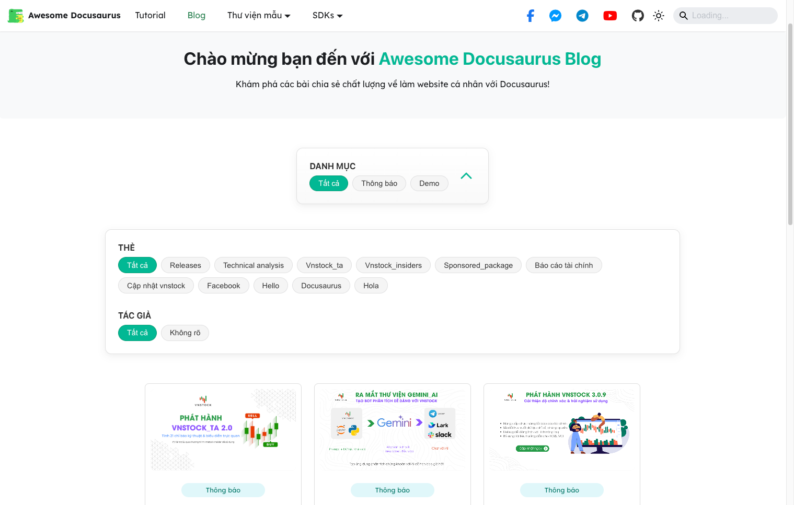
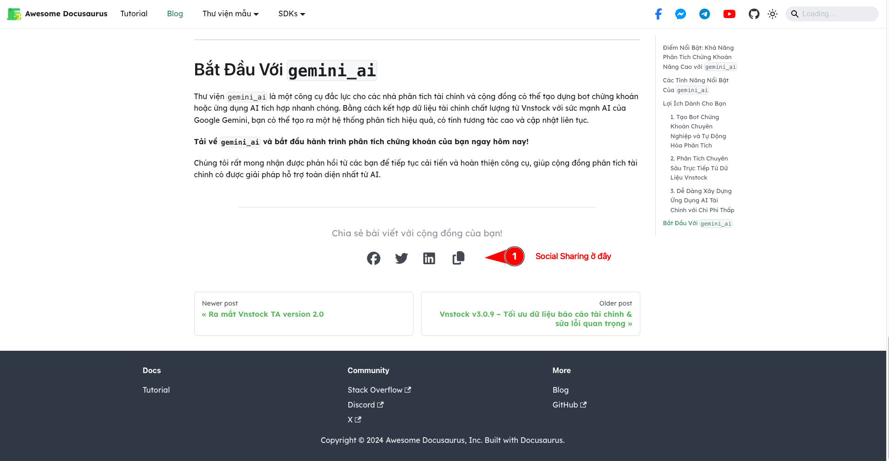
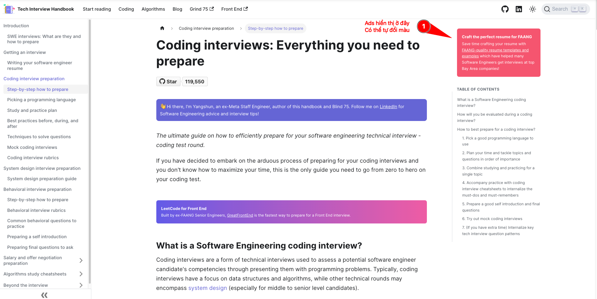

:::success
Theme Swizzle là khả năng tuỳ biến & ghi đè các thiết lập mặc định của Docusaurus. Các thiết lập được thực hiện tại thư mục `src/theme`
:::

## Blog Grid Cards

Tuỳ biến giao diện Blog thành dạng lưới với thông tin xem trước như hình dưới đây thay vì hiển thị mặc định khó theo dõi tổng quan và lọc bài viết cần tìm.



Bộ lọc bài viết có thể mở rộng để lọc nâng cao với các thông tin thuộc tính bài viết trong phần yaml frontmatter



Mẫu yaml frontmatter cần thiết:

```yaml
---
title: Vnstock v3.0.9 – Tối ưu dữ liệu báo cáo tài chính & sửa lỗi quan trọng
description: Khám phá bản phát hành mới nhất Vnstock v3.0.9 với nhiều cải tiến tối ưu hóa dữ liệu và sửa lỗi 404 quan trọng. Cập nhật ngay để trải nghiệm!
slug: vnstock-v3-0-9-nang-cap-du-lieu-bao-cao-tai-chinh
keywords:
- cập nhật vnstock
- báo cáo tài chính
image: https://vnstocks.com/assets/images/phat-hanh-vnstock3-release-v3-0-9-cd6b23b3d1d0dc11bc19bd43dfe4d246.png
domain: vnstocks.com
date: 2024-11-02
category: Thông báo
tags:
- báo cáo tài chính
- cập nhật vnstock
---
```

## Social Sharing

Tính năng này hiển thị các nút chia sẻ lên mạng xã hội, mặc định với 4 tuỳ chọn gồm Facebook, Twitter, Linkedin vả copy link.

Cần component `src/components/SocialSharing` để có thể hoạt động. Ngoài ra cần package brand của Fontawesome.

```
npm install @fortawesome/free-brands-svg-icons
```



## Sidebar Ads

> Inspired bởi trang [Tech Interview Handbook](https://github.com/yangshun/tech-interview-handbook/tree/main/apps/website/src/theme/TOC). Tính năng này cho phép chèn hộp thoại quảng cáo vào phần sidebar của Blog/Docs.

- Đổi tên thư mục `src/theme/TOC123` thành `TOC` để ghi đè theme
- Thiết lập này cần component `src/components/SidebarAd`



## Footer

## Thêm Subscribe Box

Thêm hộp đăng ký bản tin Substack vào trước footer mặc định. Hộp đăng ký hiển thị 1 hàng trên Desktop, 2 hàng trên mobile.

1. Cần sử dụng component `src/components/SubscribeFooter`
2. Cần tuỳ biến layout tại `src/theme/Footer`


## Thêm Footer Contact

```
npm install --save @fortawesome/react-fontawesome @fortawesome/free-brands-svg-icons @fortawesome/free-solid-svg-icons @fortawesome/fontawesome-svg-core
```

